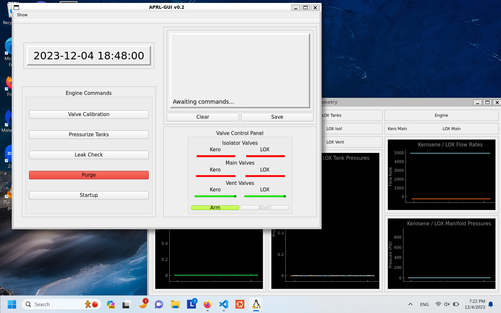
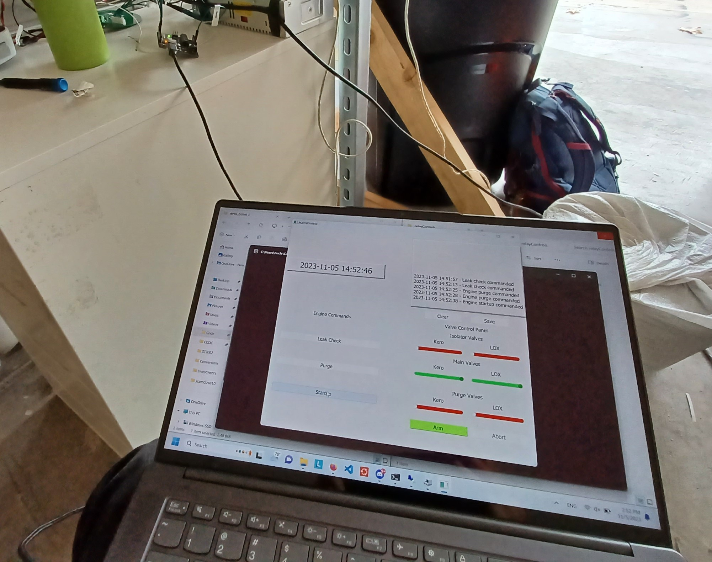
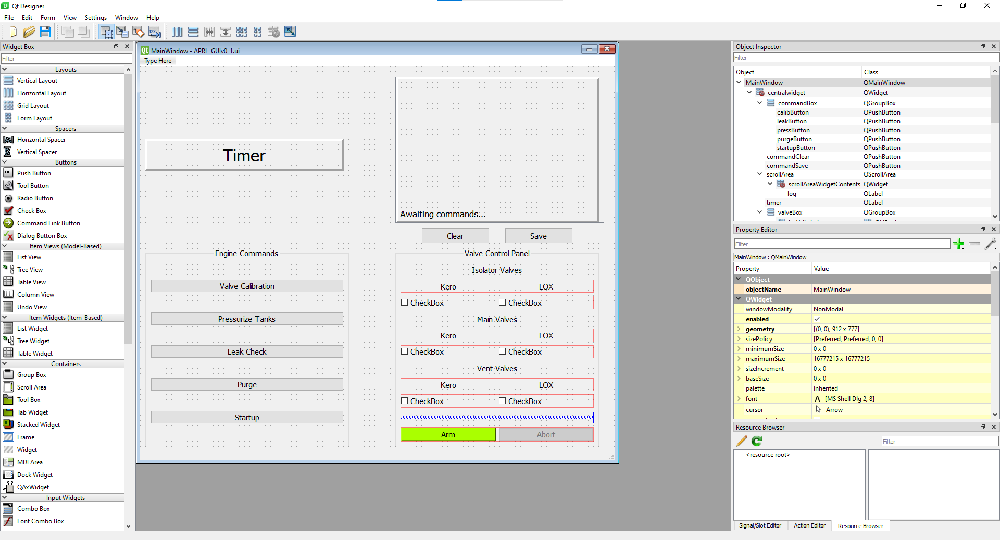

# APRL-GUI 
A frontend application for viewing engine telemetry and controlling engine systems, built in Qt 5.



## Index
* [Install](#install)
    * [Stable Release](#stable-release)
    * [Unstable Release](#unstable-release)

* [Use](#use)

* [Contributing](#contributing)
    * [Dependencies](#dependencies)
    * [Workflow](#workflow)
   


## Install 

### Stable Release
To install the latest stable version of APRL GUI, go to <https://github.com/UC-Davis-APRL/APRL_GUI/releases> and download the appropriate version for your operating system.

### Unstable Release
If you are interested in the unstable version, clone the Git repository and use the executables in there. At that point, you're probably already a contributor or helping contribute to the code.

## Use

For now, we are using a Serial connection to a microcontroller board (Arduino / Teensy) to control the valves on the test stand. As such, **please make sure the board is plugged in to your computer, or else the executable will crash!**


*(What the setup should look like)*


## Contributing
If you are interested in contributing, message me on Discord ```(@Jason H/@nuclearfizzler)``` and and we'll go from there.

### Dependencies
The following libraries are required for the Python script to run.
* PyQt5
* qtwidgets
* qtpy
* PySerial (serial)

The ```pyinstaller``` library is neccesary to compile the Python script into a Windows executable/Linux binary depending on which OS your Python is installed in.

Run the following command to install neccesary packages for development.
```shell
pip install pyqt5 qtwidgets qtpy pyserial pyinstaller
``` 
I also recommend you install Qt 5 Designer to be able to work on the UI. 


### Workflow
Creating the elements of the GUI involves using Qt5 Designer to create the ```APRL_GUIvX_X.ui``` file. This allows you to create the GUI in a visual manner, without needing to worry too much about the code.



To compile the ```.ui``` file into a runnable Python script, run
```shell
pyuic5 -x APRL_GUIvX_X.ui -o name_of_output_file.py
```

Please regard the following warning in the auto-generated files:
```python
# WARNING! All changes made in this file will be lost!
```
Don't overwrite the ```APRL_GUIvX_X.py``` file! All the custom control code that gives the script its functionality will be lost if you overwrite it. Instead, write any new changes to the UI to a ```dev.py``` file, and merge the changes manually. I am looking at better ways to do this, but for now please do it this way.

